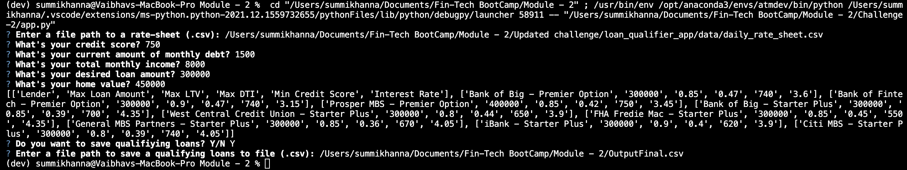

# Loan Qualifier CLI

This is a command-line interface application for matching the applicants with the qualifying loans. This application records the inputs of user and match them with the loan qualifier criteria, based on which the user gets to see the list and details of qualifying loans. It also allows a user to save the results into csv file which can be used for future references.


---

## Technologies

It supports Python 3.7 and above.  
Install the following libraries:  
- [python-fire](https://github.com/google/python-fire) - For the command line interface, help page, and entry-point.
- [questionary](https://pypi.org/project/questionary/) - For interactive user prompts and dialogs

---

## Installation Guide

Before running the application first download the whole folder named "loan_qualifier_app" and then install the following dependencies:

```python
  pip install fire
  pip install questionary
```
---
## Usage

To use this loan qualifier tool follow the below steps:

- Make sure you are using pyhton version 3.7 and above. To check that use `python --version`
- Run `python app.py` and follow the questionary to provide the inputs.
- For questionary `Enter a file path to a rate-sheet (.csv)?` you can use file path as `Challenge-2/data`
- For questionary `Enter a file path to save a qualifying loans to file (.csv)?` Provide the file path where you want to save the output csv file.

### Check below snippet as running example:  
    
 

---

## Contributors
 
Summi Khanna  
Email : sam.summo2812@gmail.com  
LinkedIn : https://www.linkedin.com/in/summi-khanna-004a60187/

---

## License

MIT License

---
